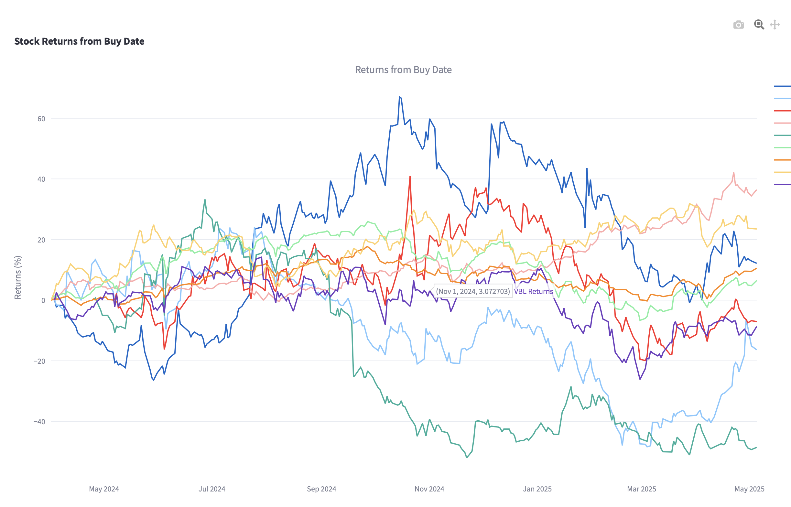
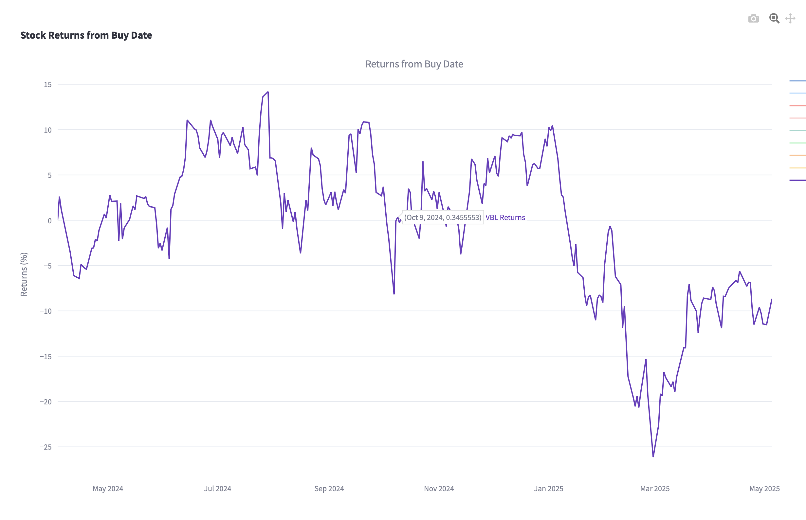

# 📈 Stock Returns Viewer (Zerodha Tradebook)

A Streamlit app to visualize stock returns from buy date, based on Zerodha-style tradebook CSVs.

## Features

- Upload Zerodha `tradebook-EQ.csv`
- Automatically fetch stock data from Yahoo Finance
- Plot returns from each buy date
- Show unavailable stocks in a warning
- Global visit counter (powered by npoint.io)

## Try It Online

👉 [Streamlit Cloud Link Here](https://portfoliotrackerzerodha.streamlit.app/)

## Run Locally

```bash
pip install -r requirements.txt
streamlit run app.py
```

## Screenshot





## License

